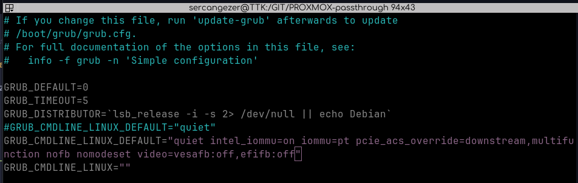

# PROXMOX üzerinde GPU Passthrough Yapmak

* `GRUB` konfigürasyonunu değiştiriyoruz.

```bash
vim /etc/default/grub

# Aşağıdaki satırı yorum haline getiriyoruz.
GRUB_CMDLINE_LINUX_DEFAULT="quiet"

# Aşağıdaki satırı ekliyoruz.
GRUB_CMDLINE_LINUX_DEFAULT="quiet intel_iommu=on iommu=pt pcie_acs_override=downstream,multifunction nofb nomodeset video=vesafb:off,efifb:off"

# Kaydedip çıkıyoruz
:wq
```



* Yaptığımız değişiklikleri kaydediyoruz.

```bash
update-grub
```

* Sistem boot ederken modüllerin yüklenmesini sağlıyoruz.

```bash
vim /etc/modules

# Aşağıdaki satırları ekliyoruz.
vfio
vfio_iommu_type1
vfio_pci
vfio_virqfd

# Kaydedip çıkıyoruz
:wq
```

* IOMMU remapping için konfigürasyon ekliyoruz.

```bash
vim /etc/modprobe.d/iommu_unsafe_interrupts.conf

# Aşağıdaki satırları ekliyoruz.
options vfio_iommu_type1 allow_unsafe_interrupts=1

# Kaydedip çıkıyoruz
:wq

vim /etc/modprobe.d/kvm.conf

# Aşağıdaki satırları ekliyoruz.
options kvm ignore_msrs=1

# Kaydedip çıkıyoruz
:wq
```

* GPU driver modüllerini blacklist e alıyoruz.

```bash
vim /etc/modprobe.d/blacklist.conf

# Aşağıdaki satırları ekliyoruz.
blacklist radeon
blacklist nouveau
blacklist nvidia
blacklist nvidiafb

# Kaydedip çıkıyoruz
:wq
```

* !! Burası biraz karışık. Ekran kartının serial/vendor numaralarını buluyoruz.

```bash
lspci -v
lspci -n -s (PCI card address)

# ÖRNEK

root@passthrough:~# lspci -v | grep -i VGA
0000:21:00.0 VGA compatible controller: NVIDIA Corporation GP107GL [Quadro P620] (rev a1) (prog-if 00 [VGA controller])

root@passthrough:~# lspci -n -s 0000:21:00.0
0000:21:00.0 0300: 10de:1cb6 (rev a1)

GPU NUMBER: 10de:1cb6
AUDIO NUMBER: 10de:0fb9 (grep -i AUDIO olarak aratınca buluyorsun)


vim /etc/modprobe.d/vfio.conf

# options vfio-pci ids=(GPU number,Audio number) disable_vga=1
options vfio-pci ids=(10de:1cb6,10de:0fb9) disable_vga=1

# Kaydedip çıkıyoruz
:wq
```

* Yaptığımız bütün değişikliklerin kaydedelim.

```bash
update-initramfs -u
```

* Ardından PROXMOX sunucusu yeniden başlatılır.

```bash
reboot now
```


# Kaynak

[Configure Proxmox GPU Passthrough (Step-by-Step Tutorial)](https://www.youtube.com/watch?v=IE0ew8WwxLM)